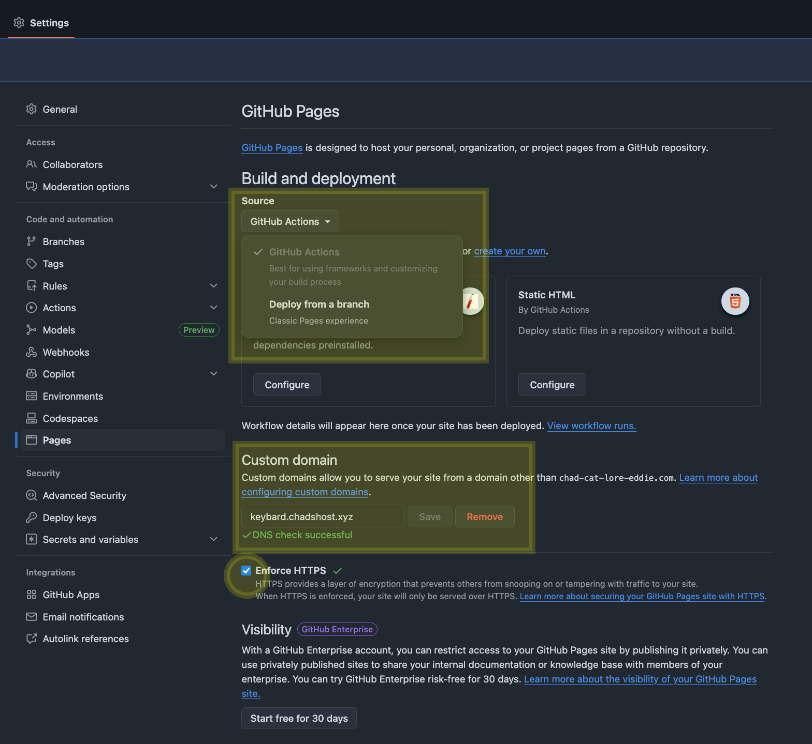
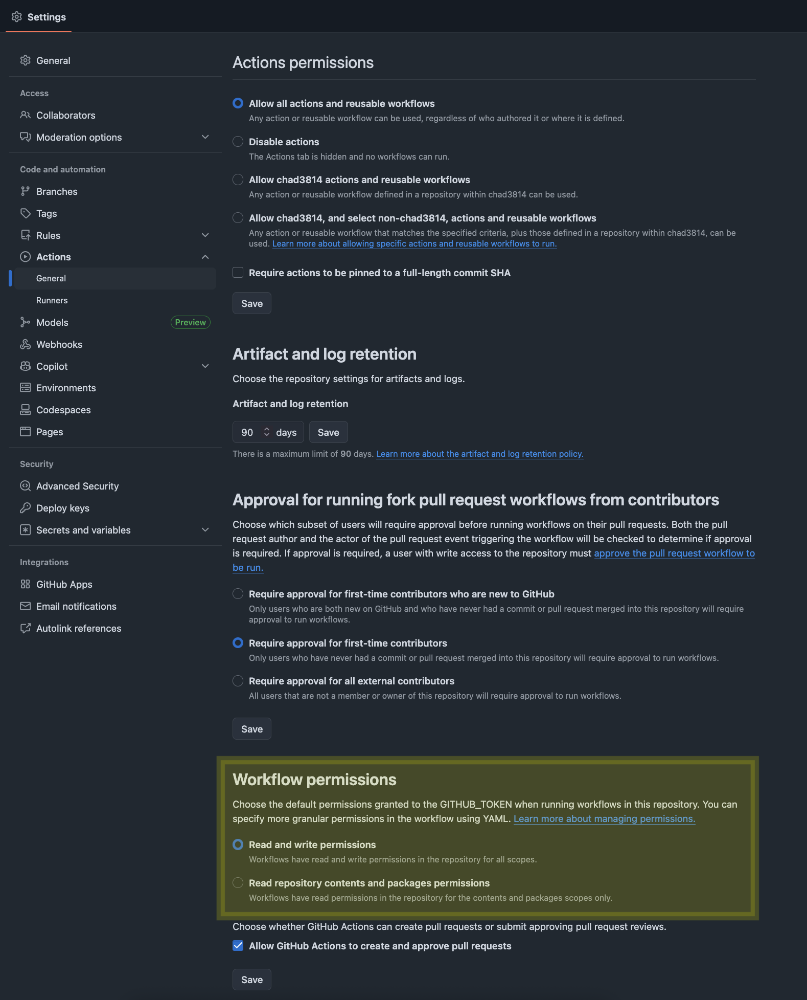
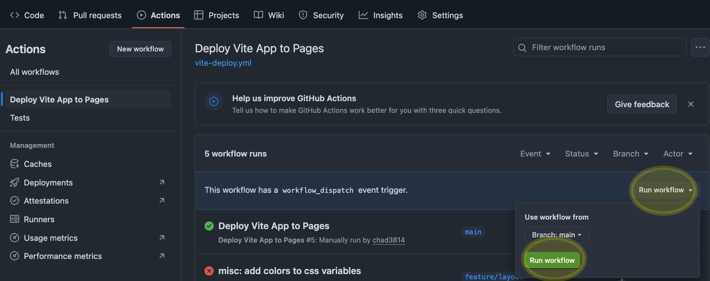
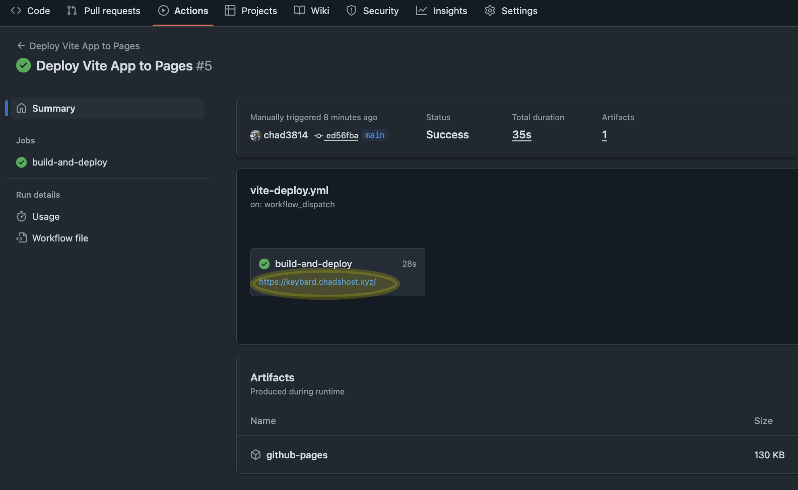
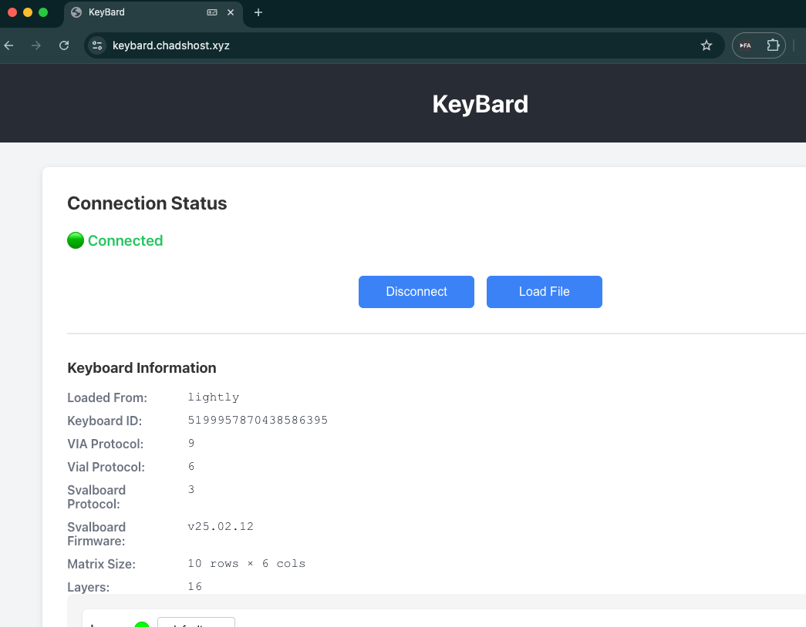

# GitHub Pages Setup Guide

This guide walks you through deploying your Vite application to GitHub Pages using GitHub Actions.

## Prerequisites

- A GitHub repository with a Vite application
- Node.js project with `package.json` configured
- Vite build configuration in `vite.config.ts`

## Setup Steps

### 1. Configure Repository Settings

#### Enable GitHub Pages with GitHub Actions

1. Navigate to your repository on GitHub
2. Click **Settings** → **Pages** (in the left sidebar)
3. Under **Build and deployment**, set **Source** to **GitHub Actions**



**Note:** The screenshot shows a custom domain configured (`keybard.chadshost.xyz`). This is optional - your site will work at `https://[username].github.io/[repo-name]` without a custom domain.

#### Configure Actions Permissions

1. Navigate to **Settings** → **Actions** → **General**
2. Scroll down to **Workflow permissions**
3. Select **Read and write permissions**
4. Ensure **Allow GitHub Actions to create and approve pull requests** is checked
5. Click **Save**



### 2. Trigger Deployment

#### Option A: Push Changes
Push changes to any files in the watched paths:
- `src/**`
- `package.json`
- `package-lock.json`
- `vite.config.ts`
- `tsconfig.json`

#### Option B: Manual Trigger
1. Go to **Actions** tab in your repository
2. Select **Deploy Vite App to Pages** workflow
3. Click **Run workflow** → **Run workflow**



### 3. Monitor Deployment

1. Navigate to the **Actions** tab
2. Click on the running workflow
3. Monitor the **build-and-deploy** job
4. Once complete (✅), the deployment URL will be displayed



### 4. Access Your Deployed Site

Once deployment succeeds, your site will be available at:
- **Default URL:** `https://[username].github.io/[repo-name]/`
- **Custom Domain:** If configured (e.g., `https://keybard.chadshost.xyz/`)



## Troubleshooting

### Blank Page or 404 Errors

If you see a blank page or 404 errors:

1. **Verify build output:**
   - Check that `dist` folder contains `index.html` and assets
   - Run `npm run build` locally to test

2. **Check deployment environment:**
   - Ensure Settings → Pages shows "GitHub Actions" as the source
   - Verify the workflow completed successfully in Actions tab

### Workflow Fails

1. **Check Actions permissions** (Settings → Actions → General)
   - Ensure "Read and write permissions" is selected

2. **Verify Pages settings** (Settings → Pages)
   - Source must be set to "GitHub Actions"

3. **Review workflow logs** (Actions tab → Click failed run)
   - Look for specific error messages in the logs

### Custom Domain Issues

1. **DNS Configuration:**
   - For apex domain (example.com): Create A records pointing to GitHub IPs
   - For subdomain (www.example.com): Create CNAME record pointing to `[username].github.io`

2. **HTTPS Enforcement:**
   - Enable "Enforce HTTPS" in Settings → Pages after DNS propagates
   - DNS propagation can take up to 24 hours

## Additional Notes

### Repository-Specific Deployment

The workflow includes a condition to prevent deployment for the main `svalboard` repository:

```yaml
if: github.repository_owner != 'svalboard'
```

This ensures the workflow only runs on forks. If you're the repository owner, this condition will automatically allow deployment.

## Resources

- [GitHub Pages Documentation](<https://docs.github.com/en/pages>)
- [Vite Deployment Guide](<https://vitejs.dev/guide/static-deploy.html#github-pages>)
- [GitHub Actions Documentation](<https://docs.github.com/en/actions>)
